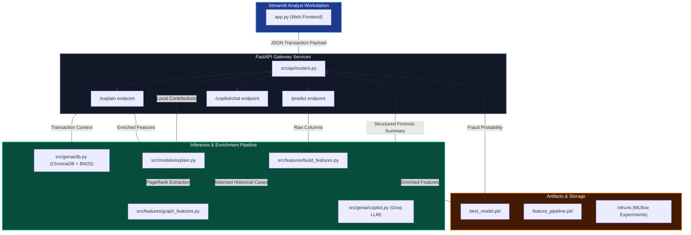

# 🛡️ Enterprise Fraud Intelligence Console

[](https://fastapi.tiangolo.com)
[](https://streamlit.io)
[](https://xgboost.readthedocs.io)
[](https://mlflow.org)
[](https://optuna.org)
[](https://groq.com)

An enterprise-grade, decision-support platform designed for fraud analysts and credit card risk intelligence teams. This platform integrates real-time machine learning inference, complex feature engineering (temporal, geographical, and network graph dynamics), model explainability via SHAP, and a retrieval-augmented generation (RAG) forensic copilot.

---

## 📖 Table of Contents
1. [Project Overview](#-project-overview)
2. [Why This Repository Stands Out](#-why-this-repository-stands-out)
3. [System Architecture](#-system-architecture)
4. [Technology Stack](#-technology-stack)
5. [End-to-End Workflow](#-end-to-end-workflow)
6. [Core Pipeline Features](#-core-pipeline-features)
   - [Data Quality Validation (Great Expectations)](#data-quality-validation-great-expectations)
   - [Real-time Feature Engineering & Graph Analytics](#real-time-feature-engineering--graph-analytics)
   - [Model Selection & Hyperparameter Tuning](#model-selection--hyperparameter-tuning)
   - [Explainable AI (SHAP Local Attribution)](#explainable-ai-shap-local-attribution)
   - [Hybrid Vector-Lexical RAG Retriever](#hybrid-vector-lexical-rag-retriever)
   - [Forensic Analyst Copilot Chat](#forensic-analyst-copilot-chat)
7. [Directory Structure](#-directory-structure)
8. [Installation & Setup](#-installation--setup)
9. [Running the Application](#-running-the-application)
10. [Engineering Decisions & Trade-offs](#-engineering-decisions--trade-offs)
11. [Skills Demonstrated](#-skills-demonstrated)
12. [License](#-license)

---

## 🔍 Project Overview

Typical fraud detection systems output a binary risk label (`0` or `1`) or a raw probability score, leaving analysts to guess the underlying reasoning. This system bridges the gap between machine learning predictions and actionable human investigation. It acts as an **Analyst Workstation** that not only predicts fraud with high precision but also immediately structures a logical forensic argument explaining the "Why," retrieving historical evidence, and providing a chat-based assistant for deeper exploration.

### The Business Impact
- **Reduced Alert Fatigue**: Focuses analyst resources on transactions with high model confidence and statistical deviation.
- **Improved False Positive Friction**: Allows dynamically optimizing decision thresholds based on actual dollar losses rather than arbitrary probability targets.
- **Accurate Audit Trail**: Combines reproducible MLflow model logging with structured natural language reports generated from local SHAP attributions.

---

## ✨ Why This Repository Stands Out
- **Production-Oriented Layout**: Clear separation of concerns between training orchestration (`run.py`), feature construction (`src/features`), data quality (`src/data`), REST API backend (`src/api`), and user-facing streamlit client (`app.py`).
- **Graph Network Topology**: Leverages network theory by computing real-time graph centrality (NetworkX PageRank) to quantify customer-to-merchant relationship anomalies.
- **Hybrid Search RRF Retrieval**: Uses Reciprocal Rank Fusion (RRF) to merge vector search (embeddings) with keyword queries (BM25) over historical fraud summaries, representing state-of-the-art enterprise search practices.
- **Constraint-Driven LLM Forensics**: Restricts Groq completions strictly to the transaction payload and SHAP parameters to eliminate hallucinations.

---

## 🏗️ System Architecture



---

## 🛠️ Technology Stack

| Domain | Technologies |
| :--- | :--- |
| **Core Languages** | Python 3.11+, HTML5 |
| **Backend Frameworks** | FastAPI, Uvicorn, Pydantic |
| **Frontend UI** | Streamlit (Native components) |
| **Machine Learning** | XGBoost, LightGBM, CatBoost, Scikit-Learn, Joblib |
| **Model Explainability** | SHAP (Shapley Additive exPlanations) |
| **MLOps / Tracking** | MLflow, Optuna (Hyperparameter Tuning), Great Expectations |
| **Graph Analytics** | NetworkX (Bipartite graphs & PageRank) |
| **GenAI / Vector Search** | Groq API (`llama-3.3-70b-versatile`), ChromaDB, Rank-BM25 |
| **Testing** | Pytest |

---

## 🔄 End-to-End Workflow

1. **Ingest & Verify**: The raw transactions are ingested and downcast to preserve memory. Great Expectations runs schema verification, boundary constraints, and categorical boundary checks.
2. **Feature Transform**: Features are transformed:
   - Calculating Haversine distance between customer home coordinates and merchant location.
   - Engineering cyclic hour/day patterns using sine and cosine transformations.
   - Performing Network PageRank analysis over bipartite customer-merchant transaction graphs.
   - Computing rolling counts and spending sums over 1-hour and 24-hour windows.
3. **Inference**: The active Champion model evaluates the feature array, returning a probability score.
4. **Attribution**: SHAP determines feature importances, outputting exact impact weights for top Risk Drivers and Safety Signals.
5. **Contextual Retrieval**: BM25 lexical search and ChromaDB vector embeddings run in parallel over historical fraud narratives, combining matches via Reciprocal Rank Fusion (RRF).
6. **Report Compilation**: Llama-3.3 processes the payload context, SHAP outputs, and similar historical cases to generate a brief, multi-heading forensic report.
7. **Copilot Chat**: The analyst can converse with the Copilot to query specific risk metrics and ask clarification questions based on the active report context.

---

## 🧪 Core Pipeline Features

### Data Quality Validation (Great Expectations)
Before training, the data is pushed through schema assertion checks:
```python
# src/data/validate.py
def validate_dataset(df: pd.DataFrame, dataset_name: str) -> bool:
    validator = ge.from_pandas(df)
    validator.expect_table_columns_to_match_ordered_list(expected_columns)
    validator.expect_column_values_to_not_be_null("cc_num")
    validator.expect_column_values_to_be_between("amt", min_value=0.01, max_value=50000.0)
    # Returns True if validation suite passes
```

### Real-time Feature Engineering & Graph Analytics
- **Haversine Distance**: Computes literal geographical differences:
  $$\text{Distance (km)} = 2R \arcsin\left(\sqrt{\sin^2\left(\frac{\Delta \text{lat}}{2}\right) + \cos(\text{lat}_1)\cos(\text{lat}_2)\sin^2\left(\frac{\Delta \text{long}}{2}\right)}\right)$$
- **Cyclic Hour Encoding**: Encodes temporal variables using sine and cosine frequencies to preserve continuous time transitions (e.g. hour 23 being closest to hour 0).
- **PageRank Extraction**: Structures the transactions as a bipartite graph of `cc_num` and `merchant` entities to compute the centrality score, catching complex card testing ring dynamics.

### Model Selection & Hyperparameter Tuning
We optimize and compare 4 algorithms under MLflow run tracking:
1. **XGBoost (Active Champion)**: Excels at high class imbalance (Precision-Recall AUC of **0.95**).
2. **LightGBM**: Rapid training baseline.
3. **CatBoost**: Excellent categorical feature optimization.
4. **Random Forest**: Standard bagging baseline.

We use **Optuna** to optimize learning rates, estimators, and max depth bounds dynamically, logging outputs directly into the local MLflow server registry.

### Explainable AI (SHAP Local Attribution)
Instead of global feature importances, the system computes **local Shapley contributions** for the individual transaction. These are split into:
- **Risk Drivers**: Features that pushed the prediction closer to `Fraud`.
- **Safety Signals**: Features that pushed the prediction closer to `Clear`.

### Hybrid Vector-Lexical RAG Retriever
To surface similar historical incidents for the forensic report, we use an **RRF (Reciprocal Rank Fusion)** retriever matching semantic intent (SentenceTransformers) and word matches (BM25):
```python
# src/genai/db.py
# RRF Scoring: RRF_Score = 1 / (60 + rank_dense) + 1 / (60 + rank_sparse)
```

### Forensic Analyst Copilot Chat
The analyst chat console runs standard Streamlit message interfaces connected to the Llama-3.3 LLM. It relies on strict contextual constraints to prevent model hallucination:
- It can only answer questions using the provided `report_context` generated by the explainability engine.
- If information is not present, it refuses to guess, ensuring high-fidelity enterprise audits.

---

## 📁 Directory Structure

```
.
├── .github/                  # CI/CD Workflows
├── src/                      # Source Code Directory
│   ├── data/                 # Data Ingestion & Quality Validation
│   │   ├── ingest.py
│   │   └── validate.py
│   ├── features/             # Spatial, Temporal, and Graph Feature Pipelines
│   │   ├── build_features.py
│   │   └── graph_features.py
│   ├── models/               # Model Training, Evaluation, and SHAP Explainers
│   │   ├── train.py
│   │   ├── evaluate.py
│   │   └── explain.py
│   ├── genai/                # ChromaDB Vector Stores and RAG Copilot Implementations
│   │   ├── db.py
│   │   └── copilot.py
│   └── api/                  # FastAPI Application and Routers
│       ├── main.py
│       ├── schemas.py
│       └── routers.py
├── tests/                    # Unit Tests
├── app.py                    # Streamlit Analyst Dashboard
├── run.py                    # Training & Optimization Orchestrator CLI
├── requirements.txt          # Package Dependencies
├── Dockerfile                # API Service Container Definition
└── docker-compose.yml        # Multi-service Orchestration Config
```

---

## ⚙️ Installation & Setup

### Prerequisites
- Python 3.11 or higher
- Git

### 1. Clone the Repository
```bash
git clone https://github.com/your-username/fraud-intelligence-system.git
cd fraud-intelligence-system
```

### 2. Set Up Virtual Environment
```bash
python -m venv venv
# On Windows
venv\Scripts\activate
# On macOS/Linux
source venv/bin/activate
```

### 3. Install Dependencies
```bash
pip install -r requirements.txt
```

---

## 🚀 Running the Application

### 1. Run the Training Orchestrator (Optional)
To run data ingestion, quality validation, feature extraction, and train the XGBoost champion model:
```bash
python run.py --sample-size 15000
```
This saves the fitted model artifacts to the `./models` directory.

### 2. Start the Backend API Server
Start the FastAPI server on port 8000:
```bash
python -m uvicorn src.api.main:app --host 127.0.0.1 --port 8000
```

### 3. Launch the Streamlit Frontend Console
Start the Streamlit dashboard in a separate terminal:
```bash
streamlit run app.py --server.port 8502
```
Now, open your browser and navigate to **`http://localhost:8502`**.

---

## 🧠 Engineering Decisions & Trade-offs

### XGBoost vs. Autoencoders for Fraud Detection
In many academic settings, Autoencoders are used for unsupervised anomaly detection. However, in production credit card networks:
- **Decision Boundary Rigidity**: Autoencoders suffer from threshold drift and high false-positive rates when consumer spending patterns change.
- **Latency & Scale**: Gradient boosted trees (XGBoost) provide sub-10ms inference latencies on structured tabular data, outperforming deep reconstruction models in latency-critical payment gateways.
- **Explainability**: SHAP works natively and efficiently with TreeExplainer architectures, providing robust local attributions, whereas explaining deep neural network layers requires computationally expensive approximation steps.

### Why Lexical (BM25) and Semantic (Vector) Hybrid Retrieval?
Vector search alone often fails on structured financial identifiers, exact product keywords, or merchant categories (e.g. matching `shopping_net` with `grocery_pos` solely on vector similarity). By using a hybrid setup combined with Reciprocal Rank Fusion (RRF), we get the best of both worlds: semantic topic recognition from embeddings and strict exact-phrase matching from BM25 lexical ranks.

---

## 🎓 Skills Demonstrated
- **Production Architecture**: Decoupling compute endpoints (FastAPI) from analytics visualization (Streamlit).
- **Data Engineering**: Constructing complex rolling window calculations, coordinate transformations, and bipartite graph entities.
- **MLOps Best Practices**: Hyperparameter space optimization (Optuna), experiment metrics logging (MLflow), and rigorous pipeline data contracts (Great Expectations).
- **Generative AI Integration**: Embedding search retrieval (ChromaDB), reciprocal rank merges, and context-constrained prompting for secure agent environments.

---

## 📄 License
This project is licensed under the MIT License - see the LICENSE file for details.
