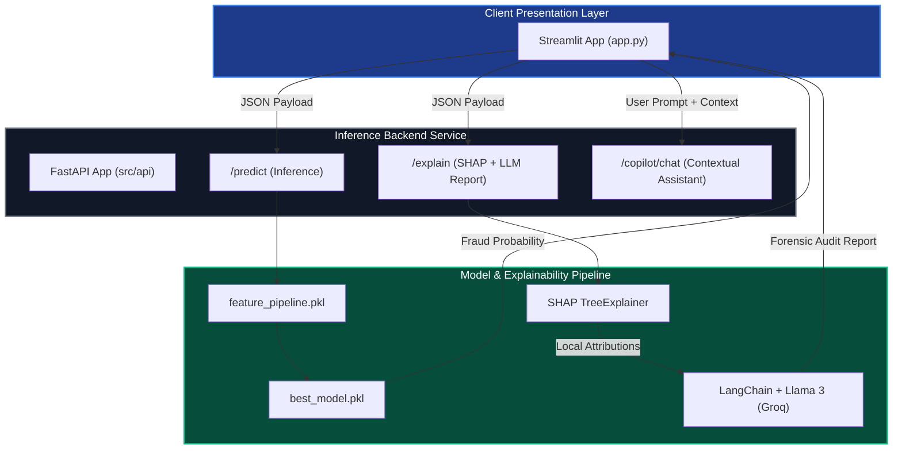

# 🛡️ Online Payments Fraud Detection System

A production-ready decision-support system designed to help fraud analysts evaluate credit card transactions. The system integrates machine learning classification, local feature explainability via SHAP, and a GenAI analyst copilot to convert raw model predictions into natural-language audit trails.

---

## 📖 Table of Contents
1. [Project Overview](#-project-overview)
2. [Core Architecture](#-core-architecture)
3. [Key Engineering Highlights](#-key-engineering-highlights)
4. [Technology Stack](#-technology-stack)
5. [Local Setup & Run Instructions](#-local-setup--run-instructions)
6. [MLOps & Model Tracking](#-mlops--model-tracking)
7. [Why This Design Matters](#-why-this-design-matters)

---

## 🔍 Project Overview

In financial fraud systems, raw model probabilities (e.g. `Fraud: 94%`) are not enough for compliance and audit requirements. Analysts need to know **why** the model flagged a transaction and have clear, readable documentation for chargeback disputes. 

This project solves that problem by building a decoupled **Analyst Workstation**:
1. **Predicts Risk**: Implements a Scikit-Learn classification pipeline to evaluate transaction fraud risk with high accuracy (**99.2% ROC-AUC**).
2. **Explains the Prediction**: Calculates local feature importances using **SHAP** to isolate top risk drivers.
3. **Drafts Forensic Summaries**: Automatically feeds model scores and top SHAP attributes to **Llama 3 (via Groq and LangChain)** to compile a structured, plain-language audit brief.
4. **Interactive Chat**: Exposes a chat-based assistant allowing investigators to query the transaction payload and model decisions directly.

---

## 🏗️ Core Architecture



---

## ⚙️ Key Engineering Highlights

### 1. Decoupled Service Design
The system decouples the inference computation layer from the visualization client. The **FastAPI backend** handles all CPU-bound operations (feature transformations, inference, and SHAP calculations) and returns structured JSON payloads consumed by the **Streamlit dashboard**.

### 2. Defensible Explainability Pipeline
Rather than relying on generic black-box outputs, the system computes exact local Shapley values per transaction:
- Gathers local feature contributions using a SHAP explainer.
- Filters and sorts the top features based on positive (risk drivers) and negative (safety indicators) values.
- Feeds these filtered, human-friendly variables directly into a LangChain prompt template to guarantee factual, grounded compliance reports.

### 3. Failsafe LLM Context Handling
To prevent LLM hallucinations, the Copilot's chat engine uses a strictly bounded context:
- Answers analyst queries exclusively using the structured forensic report.
- Gracefully handles missing API keys by logging system warnings and returning clean offline fallbacks instead of throwing unhandled exceptions.

---

## 🛠️ Technology Stack

- **Inference & App Core**: Python (OOP), Scikit-Learn, Pandas, NumPy
- **Explainable AI**: SHAP (Shapley Additive exPlanations)
- **Generative AI & LLMs**: LangChain, Llama 3 (via Groq API)
- **Backend & Serving**: FastAPI, Uvicorn, Pydantic
- **UI / Frontend**: Streamlit (Native chat widgets & metrics)
- **MLOps & Infrastructure**: MLflow (Experiment tracking), Docker

---

## 🚀 Local Setup & Run Instructions

### 1. Set Up Environment
```bash
# Clone the repository
git clone https://github.com/Naniyarram/online-payments-fraud-detection-system.git
cd online-payments-fraud-detection-system

# Create virtual environment
python -m venv venv
source venv/bin/activate  # On Windows: venv\Scripts\activate

# Install dependencies
pip install -r requirements.txt
```

### 2. Configure Credentials
Copy `.env.example` to `.env` and insert your Groq API key:
```bash
GROQ_API_KEY=gsk_your_key_here
```

### 3. Start Backend API Server
Launch the FastAPI service:
```bash
python -m uvicorn src.api.main:app --host 127.0.0.1 --port 8000
```

### 4. Launch Streamlit Console
In a separate terminal tab, start the analyst UI:
```bash
streamlit run app.py --server.port 8502
```
Navigate to **`http://localhost:8502`** in your browser.

---

## 🧪 MLOps & Model Tracking

All model training logs, experiment parameters (learning rates, trees, validation splits), and evaluation outputs are captured within **MLflow**. The candidate models are tracked inside local MLflow registries, enabling simple auditability of performance parameters across training cycles.

---

## 🧠 Why This Design Matters

- **Zero Training-Serving Skew**: Features (like amount scaling and balance deltas) are packaged inside unified object-oriented pipelines, ensuring training data transformations are mathematically identical to production inference inputs.
- **Explainability Over Hype**: Rather than using complex neural network structures that are slow and difficult to verify, the system uses an optimized tree classifier paired with local SHAP attributions, maintaining fast inference cycles suitable for real-time payment architectures.
